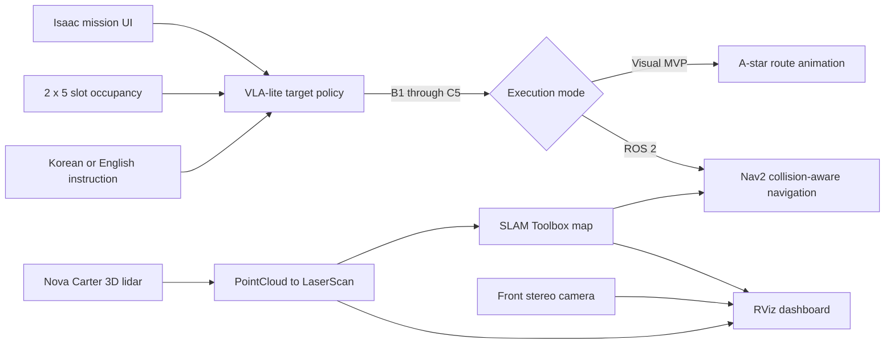

# Isaac Sim Warehouse VLA Portfolio

A Windows 11 robotics portfolio built with NVIDIA Isaac Sim 6.0.1, ROS 2 Jazzy, Nav2, SLAM Toolbox, Nova Carter, PyTorch, and Git LFS.

The current scenario moves a box from loading zone A to rack B or C. Each rack has five levels. The operator can select a fixed slot or ask the learned policy to choose an available slot.

## Demo architecture



The VLA-lite model chooses the task target from language and the visual occupancy grid. Nav2 remains responsible for collision-safe motion. This is deliberately a hybrid architecture: it is reproducible on a 12 GB RTX 4070 Ti and safer than claiming an unvalidated end-to-end VLA motor controller.

## Quick start

Build the ROS package after cloning or changing ROS files:

```powershell
cd C:\robotics-portfolio
.\scripts\build.ps1
```

Start the warehouse in Isaac Sim:

```powershell
.\scripts\start_warehouse.ps1
```

The `Warehouse Mission Control` panel opens automatically and creates the scene. Choose one of these modes:

- `Visual A*`: select B/C and levels 1-5, or press automatic empty slot. This runs without a separate ROS navigation process.
- `ROS2 Nav2`: start the navigation stack below, press `Simulation Play`, and dispatch from the same UI.

Run the full SLAM, Nav2, mission dispatcher, and RViz sensor dashboard in a second PowerShell window:

```powershell
.\scripts\start_navigation.ps1
```

For sensor visualization only:

```powershell
.\scripts\start_monitor.ps1
```

The RViz dashboard contains `/map`, `/scan`, `/front_3d_lidar/lidar_points`, TF, and `/front_stereo_camera/left/image_raw` in one window. Camera and lidar data begin after Isaac simulation is playing.

## Train the local policy

```powershell
.\scripts\train_vla.ps1
```

Training uses synthetic Korean/English instructions and randomized B/C occupancy grids. The current checkpoint was trained on 5,000 samples for 35 epochs and reached 99.9% validation accuracy on generated validation data. That number is a synthetic benchmark, not real-site accuracy.

## Local toolchain

- GPU: NVIDIA GeForce RTX 4070 Ti, 12 GB VRAM
- Isaac Sim: 6.0.1 standalone at `C:\isaacsim`
- ROS 2: Jazzy through the official Pixi workspace
- ROS workspace: `C:\IsaacSim-ros_workspaces\jazzy_ws`
- Portfolio repository: `C:\robotics-portfolio`
- ROS middleware for this demo: Fast DDS

The scene references NVIDIA's official Simple Warehouse and sensor-enabled Nova Carter USD assets. They resolve into the local Omniverse cache at runtime and are not copied into Git.

## Repository layout

```text
isaacsim_exts/warehouse.mission/  Isaac UI, scene builder, policy, and controller
ml/warehouse_vla/                 Synthetic data generation and VLA-lite training
models/warehouse_vla.pt           Trained checkpoint stored through Git LFS
ros2_ws/src/portfolio_bringup/    Nav2 dispatcher, SLAM config, RViz, and launch files
scenes/warehouse_mission.usda     Generated portable scene composition
scripts/                          Reproducible build, launch, and training commands
tests/                            Isaac integration smoke test
```

## Verification

```powershell
python -m compileall -q isaacsim_exts ml ros2_ws\src\portfolio_bringup tests
C:\isaacsim\python.bat tests\isaac_warehouse_smoke.py
```

The integration smoke test creates the USD stage, loads the trained model, completes a manual B3 mission, then completes an automatic empty-slot mission.

## Current MVP boundary

- Slot choice is learned; geometric route generation is A-star or Nav2.
- The lift and box placement are visually staged. A physics-validated forklift mast and grasp controller are the next hardware-realism step.
- SLAM uses Nova Carter's 3D lidar converted to a 2D laser scan. The displayed sensor is lidar, not automotive radar.
- Real deployment still requires site mapping, safety PLC/E-stop integration, payload validation, and real sensor calibration.

See [warehouse mission notes](docs/WAREHOUSE_MISSION.md), [Windows setup](docs/SETUP_WINDOWS.md), [portfolio roadmap](docs/PORTFOLIO_PLAN.md), and [GitHub publishing](docs/GITHUB.md).

## License

Repository source is Apache-2.0. NVIDIA and other third-party assets retain their own licenses and are referenced rather than redistributed.
